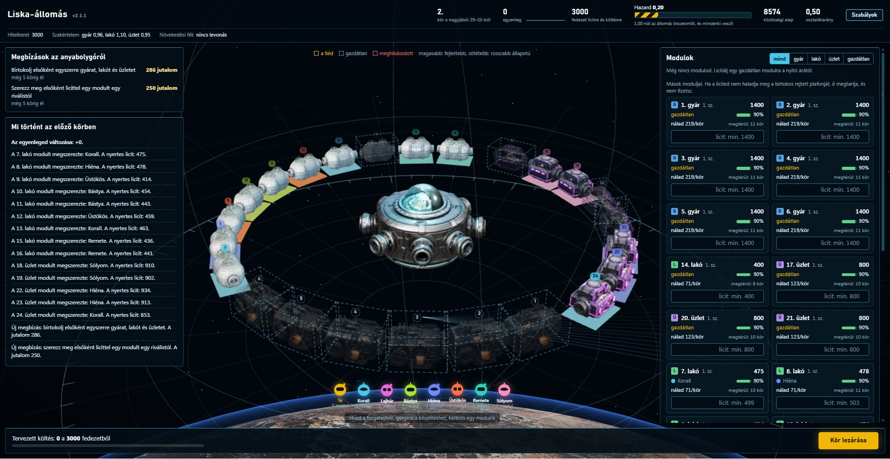

# Liska-állomás



Gazdasági stratégiai játék és kutatási szimuláció egy űrállomáson, amelyben a modulok nem tulajdonok,
hanem birtokok: mindenki maga mondja meg, mennyit ér neki a modulja, ez után járadékot fizet a közösségnek,
és aki többet ajánl érte, elviszi. A szabályrendszer Liska Tibor modelljéből indul ki. (2.1.1-es verzió)

## Liska Tibor és a Liska-modell

**Liska Tibor** (1925–1994) magyar közgazdász volt, a hazai reformközgazdaságtan egyik legeredetibb
gondolkodója. Fő műve az 1960-as években írt, de csak 1988-ban megjelent *Ökonosztát*. Elképzelését
vállalkozói szocializmusnak is nevezték; az 1980-as években kisebb kísérletekben a gyakorlatban is
kipróbálhatta, többek között szentesi, igali és baksai termelőszövetkezetekben.

A **Liska-modell** központi gondolata, hogy maga a tulajdon is verseny tárgya legyen:

- **Személyes társadalmi tulajdon.** A termelőeszköz nem az államé, és nem is magántulajdon. Az működteti,
  aki nyílt versenyben a legtöbbet vállalja érte, és amíg működteti, fizet érte a közösségnek.
- **Folyamatos licit.** A birtokos nem ülhet a helyén örökre: ha valaki többet ajánl, vagy a birtokos
  vállal többet, vagy átadja a helyét.
- **Társadalmi örökség.** Mindenki egyenlő induló tőkéhez jut, amelyet nem élhet fel, de vállalkozásához
  fedezetül használhat.
- **Az állam játékvezető.** Betartatja a szabályokat, de nem szól bele, ki mit csináljon.

A játék ezekből az elemekből építkezik: a modulok birtokok, a birtokos önértékelése után jár a járadék,
bárki túllicitálhatja, a hitelkeret a társadalmi örökség megfelelője, a járadék pedig közösségi alapba
folyik. Ami ezen túl van benne (a rejtett megtartási plafon, a válsághelyzetek, a kereskedőhajó, a
megbízások, a szakértelem), az játéktervezési döntés, nem Liska modelljének része. A játék tehát nem a
modell hű szimulációja, hanem egy belőle kiinduló kísérlet.

Olvasnivaló:

- F. Liska Tibor: *A Liska-modell.* Közgazdasági Szemle, 1998/10., 940–953. o.
- Liska Tibor: *Ökonosztát.* Közgazdasági és Jogi Könyvkiadó, 1988.

## Mi van a csomagban

A szabályspecifikáció („Liska-játék v2 – szabályspecifikáció") megvalósítása: determinisztikus
motor, közös döntési felület, két ügynöktípus, invariánstesztek és kalibráló szkript.
Külső függőség nincs, csak a tesztekhez kell a `pytest`.

## Gyors indulás

Python 3.10 vagy újabb kell hozzá, más semmi: a játéknak nincs külső függősége, és internet nélkül is fut.

```bash
git clone https://github.com/bolhaugrik/liska.git
cd liska
python -m liska.web          # a játék megnyílik a böngészőben: http://127.0.0.1:8765/
```

A gépi ellenfelekkel azonnal játszható. Gemini-ellenfelekhez és a Gemini-szimulációkhoz kulcs kell, lásd lent.

## A Gemini-kulcs beállítása

A program a kulcsot kizárólag a `GEMINI_API_KEY` környezeti változóból olvassa. Fájlba nem kell és nem
szabad írni, a repóba pedig semmilyen formában ne kerüljön be.

1. **Kulcs kérése.** A [Google AI Studio](https://aistudio.google.com/) oldalán, az „API key" menüpontban.
2. **Elrakás Windowson (PowerShell).** Tartósan, minden később nyitott terminálra:

   ```powershell
   setx GEMINI_API_KEY "IDE_JON_A_KULCS"
   ```

   Utána nyiss új terminált, mert a már nyitott ablak nem látja. Ha csak az aktuális ablakra kell:

   ```powershell
   $env:GEMINI_API_KEY = "IDE_JON_A_KULCS"
   ```

3. **Elrakás macOS-en vagy Linuxon.** A parancsértelmező indítófájljába (zsh esetén `~/.zshrc`, bash esetén `~/.bashrc`):

   ```bash
   echo 'export GEMINI_API_KEY="IDE_JON_A_KULCS"' >> ~/.zshrc
   source ~/.zshrc
   ```

4. **Ellenőrzés.** Egyetlen próbahívás, játék nélkül:

   ```bash
   python -m liska.run --check
   ```

Amit érdemes tudni a kulcsról:

- **Nem kerül naplóba.** A kapu a kulcsot csak a kérés fejlécében küldi el; sem a konzolra, sem az
  `--llm-log` fájlba, sem a játéknaplóba nem írja ki.
- **Ne tedd fájlba a mappán belül.** A `.gitignore` kizárja a `.env` fájlokat és a naplókat, de a
  legbiztosabb, ha a kulcs csak környezeti változóban él.
- **Ha mégis kikerült** (például bemásoltad valahová), az AI Studióban töröld, és kérj újat.
- **A keretedet** az AI Studio mutatja; a `--rpm` és `--tpm` kapcsolóval állítható, mennyit használjon a program.

## Használat

```bash
python -m liska.run --seed 1 --regime liska --log jatek.jsonl   # egy játék, napi sorokkal
python -m liska.run --seed 1 --regime private --quiet           # csak a végeredmény
python -m pytest -q                                             # 82 teszt, kb. 1 perc
python scripts/calibrate.py 50                                  # három rend, 50 seed
python scripts/izgalom.py 50                                    # mit ad a fék és a technológiaváltás
```

Saját ügynök: bármi, aminek van `decide(obs) -> Decision` metódusa.

```python
from liska import Engine, Params, Decision, Bid, run_game

class Enyem:
    def decide(self, obs):
        return Decision([Bid(m["id"], m["min_bid"]) for m in obs["modules"][:1]
                         if m["min_bid"]], "indoklás")

engine = Engine(Params(regime="liska"), seed=42, strict=True)
print(run_game(engine, lambda pid: Enyem()))
```

A döntés dict alakban is jöhet (`{"actions": [{"type": "Bid", "module": 3, "amount": 900}]}`),
így az LLM-kapu és a webes felület ugyanazt a JSON-t küldheti.

## Felépítés

| Fájl | Tartalom |
| --- | --- |
| `liska/params.py` | Minden paraméter a specifikáció jelöléseivel |
| `liska/state.py` | Állomás, játékos, modul |
| `liska/actions.py` | Öt akció, `Decision`, okkódok, dict-értelmezés |
| `liska/engine.py` | A 11 fázis, érvényesítés, licit, invariánsok, mentés |
| `liska/metrics.py` | Napi mutatók és futásösszegzés |
| `liska/runner.py` | Futtatás, JSONL eseménynapló, visszajátszás |
| `liska/agents/` | Véletlen tesztügynök, heurisztikus ügynök három profillal, LLM-ügynök |
| `liska/llm/gateway.py` | LLM-kapu a Gemini API-hoz: limitkezelés, újrapróbálás, számozott napló |
| `tests/test_engine.py` | A tíz invariáns és a fő szabályok tesztjei |
| `tests/test_llm.py` | A kapu és az LLM-ügynök tesztjei szimulált Gemini-válaszokkal |
| `liska/web/` | Helyi webes felület egy emberi játékosnak (kiszolgáló és egyetlen HTML-oldal) |
| `tests/test_web.py` | A webkiszolgáló tesztjei |
| `scripts/calibrate.py` | Rendek összevetése azonos seedeken |
| `scripts/izgalom.py` | A játékmenet mozgalmasságának mérése szabályváltozatonként |
| `scripts/modell_atalakit.py` | Nagy felbontású 3D modell (GLB) átalakítása a játékhoz: kb. 25 ezer háromszög, átsütött textúrák |
| `scripts/modell_beepit.py` | Kész, kis háromszögszámú GLB előkészítése a játékhoz (kisebb textúrák, világító térkép) |

## Mit fednek a tesztek

- **Pénzmegmaradás, határok, birtoklás, fedezet:** 270 játék véletlen ügynökökkel (rendenként 60
  alapjáték és 30 hazard nélküli, teljes hosszúságú), `strict=True` módban, ahol a motor
  fázisonként ellenőriz. A véletlen ügynök szabálytalan,
  hiányos és hibát dobó lépéseket is ad.
- **Determinizmus és visszajátszás:** azonos seed bájtra azonos naplót ad; a naplóból újrajátszott
  és a mentésből folytatott játék állapota megegyezik az eredetivel.
- **Hatástalan elutasítás, hibatűrés, sorrendfüggetlenség, rejtett adat:** külön tesztek.
- **Szabályok:** megtartás, gazdacsere és a többlet felezése, okkódok, elmaradó karbantartás,
  0. nap, járadék- és hozamképlet, medián szavazás, csőd, összeomlás.

## Játék a böngészőben

```bash
python -m liska.web            # megnyitja a böngészőt a http://127.0.0.1:8765/ címen
python -m liska.web --port 9000 --no-browser
```

Egy ember játszik a gép ellen, rövid, nagyjából 30 körös játékban. A kiszolgáló csak a saját
gépről érhető el, külső csomag nem kell hozzá. Leállítás: Ctrl+C.

- **Ugyanaz a motor.** A felület csak a saját megfigyelésedet kapja meg (mások plafonja és
  egyenlege a játék végéig rejtve marad), és ugyanazokat az akciókat küldi, mint egy ügynök.
- **Ellenfelek.** Három gépi stratégia (óvatos, terjeszkedő, potyautas), kérésre 2 vagy 4
  Gemini-játékossal heti módban. Hogy ki melyik volt, a záró rangsorból derül ki.
- **Elrendezés (2.1).** A felület sötét, teljes képernyős, középen forog az állomás, és a kép a
  panelek alatt is látszik. Fent a saját adataid (egyenleg görbével, fedezet, hitelkeret,
  szakértelem, eszközök). Bal oldalt a játékmenet: megbízások, válság, kereskedőhajó, az előző kör
  hírei. Jobb oldalt a modulok kártyákon: felül a sajátjaid szerkeszthetően, alattuk a többiek
  tömör kártyái, típus szerint szűrhetően. Az üzemeltetők ikonként lebegnek az állomás alatt, a
  beszólásaik buborékban jelennek meg. Alul a szavazás, a felajánlás és a kör lezárása.
- **Kezelés.** Az állomás húzással forgatható, görgővel közelíthető; modulra kattintva megjelennek
  az adatai, és onnan licitálni is lehet. A kártya nevére kattintva az állomás odafordul.
- **Valódi 3D modellek.** A jelenetet WebGL rajzolja (`liska/web/scene3d.js`, three.js) a
  `liska/web/models` mappa modelljeivel: gyár, lakó, üzlet, a középső mag és a kereskedőhajó. A hajó
  a bejelentéskor közelebb jön, érkezéskor a gyűrű mellé áll, távozáskor elrepül. A modulok a
  dokkolónyílásaiknál érnek össze a gyűrűn. A fejlettebb modul magasabb, a rosszabb állapotú
  sötétebb, a gazdátlan áttetsző és szaggatott keretű, a tiéd arany keretet és jelzőfényt kap,
  a meghibásodott vöröset. A modulok sorszáma és talplemeze a birtokos színét viseli, a színeket
  az „Üzemeltetők” lista és a piac is mutatja. A bolygó felszíne a `models/bolygo.jpg` kép. Ha a
  WebGL vagy a modellek betöltése nem sikerül, a régi, vászonra rajzolt nézet marad.
- **Modellcsere.** Új modell a `scripts/modell_beepit.py` szkripttel készíthető elő (kisebb
  textúrák, világító térkép); ha a modell több százezer háromszöges, előbb a
  `scripts/modell_atalakit.py` egyszerűsíti. A three.js (MIT licenc) a `liska/web/vendor` mappában
  van, internet a játékhoz nem kell.
- **Válsághelyzetek.** Időnként előre jelzett közös veszély érkezik (meteorraj, reaktorhiba,
  napkitörés). Az elhárítás árát előbb a közösségi alap tartaléka állja, a hiányt a játékosok
  titkos felajánlásai adják össze, arányosan. Ha nem jön össze, senki nem fizet, a hazard
  megugrik, és négy modul megsérül. A felajánlások utólag nyilvánosak, így látszik, ki potyázott.
  Az osztalékról szóló szavazásnak ettől valódi tétje lesz: a kisebb osztalék nagyobb tartalék.
- **Kereskedőhajó.** Időnként előre jelzett hajó érkezik az anyabolygóról. Amíg itt van, egy
  modultípus hozama 35%-kal nő, és távozásakor 500 jutalmat kap, aki abból a legtöbbet termelte.
  Az ittléte alatt körönként zárt licit megy a még el nem kelt eszközeire (a bal oldali, kiemelt
  dobozban; a hajóra kattintva is előjön): hatékonyságnövelő (+10% hozam), pajzs (egyszer
  megvéd a válság kárától), javítókészlet (minden modulod hibátlan, és három körig nem kopik, nem
  hibásodik meg). A vételár kikerül a gazdaságból.
- **Megbízások.** Mindig van legfeljebb két nyilvános köztes cél az anyabolygóról: fejlessz
  elsőként egy modult, szerezz meg licittel egy modult egy riválistól, birtokolj egyszerre mindhárom
  típusból, birtokolj négy modult, vagy tartsd minden modulodat 85% fölött három körön át. Az első
  teljesítő jutalmat kap (új pénz), a lejárt megbízás helyére új jön. A 30 körös játékban a gépi
  ellenfelekkel átlagosan 7,4 megbízás teljesül és 3,2 jár le, összesen nagyjából 1800 jutalommal.
- **Háromféle válság.** A meteorraj véletlen modulokat rongál meg, a reaktorhiba nagyobbat emel a
  hazardon és gyárakat sért, a napkitörés két körre megfelezi minden modul hozamát.
- **Riválisok arccal.** Minden gépi ellenfél nevet, stílust és sisakos arcot kap (Hiéna, Bástya,
  Lajhár…), és az események után megszólal a hírek között. A Gemini-ellenfelek a saját
  indoklásukkal szólalnak meg.
- **Vadász ellenfelek.** A hét gépi ellenfél közül kettő „vadász": a saját értékelése fölé is
  licitál, hogy elvigye az alacsony plafonú modulokat. Velük játékonként kétszer annyi a gazdacsere.
- **Automatikus karbantartás.** Modulonként bekapcsolható; körönként beírja a 90%-os állapothoz
  hiányzó összeget.
- **Rövid játék.** A `Params.short()` készlet kétszeres tempót ad: a körönkénti áramlások
  (hozam, kopás, járadék, kamat, hazard) megduplázódnak, a pénzben mért árak változatlanok.
  50 seeden a teljes játékhoz hasonlóan viselkedik: nincs összeomlás, nincs csőd, játékonként
  12,4 gazdacsere (a teljes játékban 13,9).
- **Napló.** A játék végén a mappába kerül a `jatek-ui-<seed>.jsonl`, ugyanabban a formában,
  mint a szimulációk naplója.

## LLM-játékosok (Gemini)

A kapu a `gemini-3.6-flash` modellt hívja a Gemini natív `generateContent` végpontján. A kulcsot a
`GEMINI_API_KEY` környezeti változóból olvassa; a kulcs sem a naplóba, sem a címbe nem kerül.
Külső csomag ehhez sem kell.

```bash
python -m liska.run --check                                  # 1. egy próbahívás, játék nélkül
python -m liska.run --seed 1 --llm 0,1 --llm-mode weekly \
       --llm-log llm.log --log jatek.jsonl                   # 2. két LLM-játékos, heti stratégia
python -m liska.run --seed 1 --llm all --llm-mode daily \
       --rpm 10 --llm-log llm.log --log jatek.jsonl          # 3. mindenki LLM, napi döntés
```

| Mód | Mit kérdez a modelltől | Hívás játékonként (játékosonként) | Bemenet hívásonként |
| --- | --- | --- | --- |
| `weekly` | Hetente hat beállítást választ kész lehetőségekből; a napi lépéseket a heurisztika teszi meg, minden LLM-játékosnál azonos alapbeállításokkal | kb. 10 | kb. 3400 karakter |
| `daily` | Naponta teljes akciólistát ad: árak, plafonok, licitek, karbantartás, szavazat | kb. 62 | kb. 4500–5000 karakter |

**A napló.** Minden sor időbélyeges, a végén a (helyi/összes) számpárral. Az első szám az utolsó
megállás óta küldött kérések száma, a második a futás összes kérése. Megállás minden várakozás,
utána a helyi számláló 1-ről indul:

```
[12:03:15.123] SEND → daily p3 d14 (10/123)
[12:03:16.031] RECV 908ms, 1612 be + 143 ki + 88 gondolkodás token (10/123)
[12:03:16.032] VÁR 59.1s (percenkénti kéréskeret) → a számláló újraindul
[12:04:15.140] SEND → daily p4 d14 (1/124)
```

**Limitkezelés.**
- A kapu csúszó 60 másodperces ablakban számolja a kéréseket és a bemeneti tokeneket, és küldés
  előtt megvárja, amíg belefér a keretbe (`--rpm`, `--tpm`). A tényleges tokenszámot a válaszból veszi.
- 429-nél kiírja a teljes hibaüzenetet, a szolgáltató által javasolt ideig vár, és újrapróbálja.
- Ha a napi keret merült ki, vagy a javasolt várakozás két percnél hosszabb, a kapu leáll, és a
  hátralévő játékban az LLM-játékosok helyett a heurisztika lép. A játék így is végigmegy.
- 5xx hibát és hálózati hibát visszalépéssel újrapróbál; 400, 401, 403 és 404 után nem.

**Emlékezet napi módban.** A modell minden nap új kérdést kap, ezért két dolgot visz tovább az
ügynök: a modell saját, legfeljebb 300 karakteres jegyzetét (`memo`), és az elmúlt hét
licitjeinek összesítőjét (hány nyert, hányat vert vissza megtartás, modulonként mekkora volt a
legnagyobb visszavert licit). A gazdátlan modulokat külön sorban is megkapja. Az első teljes
játékban emlékezet nélkül két belépő 163-szor licitált eredménytelenül a legkisebb összeggel.

**Ha az LLM hibázik.** Hibás, hiányos vagy értelmetlen válasz esetén a heurisztika lép, az indoklás
mezőbe pedig bekerül a „tartalék” szó és az ok. A szabálytalan akciót a motor okkóddal elutasítja.
A futás végén a kapu összegzi a hívásokat és a tokeneket, játékosonként pedig kiírja, hány döntés
jött az LLM-től és hány a tartalékból.

**Amit a saját gépeden kell ellenőrizni.** Ez a rész szimulált válaszokkal van tesztelve, élő
Gemini-hívás nem futott rajta. A `--check` megmutatja, elfogadja-e az API a kérés alakját. A
keretedet az AI Studio mutatja; az alapérték (percenként 10 kérés) szándékosan óvatos. A modell
nem fogad el egyéni hőmérsékletet, ezért a kapu nem küld ilyet.

## Megjegyzések a megvalósításhoz

- **Gini.** Az egyenleg negatív is lehet, ezért a mutató az egyenleg + induló örökség értékén számol.
- **Határidő.** A motor a hiányzó vagy hibás döntést passzolásnak veszi, de időt nem mér.
  A határidőt a hívó (LLM-kapu, webes réteg) tartatja be.

## Kalibrálás (50 seed, heurisztikus ügynökök, végleges szabályok)

| Rend | Összeomlás | Csőd | Átlagegyenleg | Állapot | Gazdacsere/modul/nap | Össztermelés |
| --- | --- | --- | --- | --- | --- | --- |
| Liska | 0% | 0 | 5578 | 0,81 | 0,008 | 111 873 |
| Magántulajdon | 18% | 0 | 3734 | 0,77 | 0,007 | 88 548 |
| Fix bérlet | 2% | 0 | 3790 | 0,77 | 0,000 | 90 044 |

- **A Liska-rend életképes.** A kiinduló paraméterekkel nincs csőd és nincs összeomlás. A
  magántulajdonos rendben a játékok 18%-a összeomlik, mert ott a potyautas profil is vásárol,
  és nem tart karban; ez a heurisztikákról szól, nem a rendről.
- **A hazard valódi tét.** Ha senki nem tart karban, az állomás átlagosan a 19. napon omlik össze;
  ha mindenki makacsul teljes osztalékra szavaz, a játékok 24%-ában.
- **A csőd csak vakmerő játéknál jön elő.** A heurisztikák nem mennek csődbe; a véletlen ügynökök
  50 játékban 17-szer, és 49 játékban összeomlasztják az állomást.

A rendek közti különbség itt nem bizonyíték a rendekről. A heurisztikák rögzített szintig
tartanak karban, tehát a beruházási ráta nem reagál az ösztönzőkre; a beruházás-visszafogás
kérdéséhez stratégiai (LLM vagy optimalizáló) ügynök kell.

## A járadék alapja: a megtartási plafon

A járadék a rejtett megtartási plafon után jár (`rent_base="cap"`), nem a nyilvános ár után.
A plafon az önértékelés: az a legmagasabb licit, amellyel szemben a birtokos még megtartja a
modult. A nyilvános ár ettől kezdve csak azt szabja meg, honnan indul a licit, és mennyi jár
biztosan a birtokosnak, ha elviszik a modulját.

A szabály az első teljes Gemini-játék (12 játékos, 664 döntés, 1-es seed) tanulsága. A régi
szabály mellett (`rent_base="price"`) a játékosok alacsony árat és annak 1,6-szorosára tett
rejtett plafont tartottak: a járadék a bevétel 10%-ára esett, és az egész játékban két gazdacsere
volt 251 megtartott licit mellett. Heurisztikus ügynökökkel az új szabály életképes: 50 seeden
nincs összeomlás és csőd, játékonként 11,5 gazdacsere van, a járadék a bevétel 24%-a (a régi
szabállyal 15%).

## Válsághelyzet (`p_crisis`, `crisis_cost`, `crisis_lead`)

Mérés 40–50 seeden, heurisztikus ügynökökkel. A teljes játékban átlagosan négy válság van,
ebből a gépi játékosok 3,3-at elhárítanak. A rövid játékban a válság drágább (modulonként 180),
mert ott az alap gyorsabban telik: így az alap a költség nagyjából 40%-át fedezi, a többi
felajánlásból jön. Ha az emberi játékos helyén álló ügynök beszáll, mind a négy válságot
elhárítják; ha potyázik, átlagosan 1,4 becsapódik. Összeomlás és csőd egyik esetben sincs.

## Mit ad a játékhoz a három mozgató szabály

| Szabály | Paraméter | Alapérték | Mit csinál |
| --- | --- | --- | --- |
| Szakértelem | `skill_spread` | 0,2 | Játékosonként és típusonként egy rejtett hozamszorzó 0,8 és 1,2 között |
| Növekedési fék | `span_penalty`, `span_free` | 0,10 és 3 | Három modul fölött minden modul 10%-kal rontja a birtokos összes hozamát |
| Technológiaváltás | `p_reskill` | 0,1 naponta | Három nappal előre jelezve egy típusnál mindenki szakértelme újrasorsolódik; az új értékét mindenki csak magáról tudja |
| Piaci fordulat | `p_shift` | 0 (kikapcsolva) | Három nappal előre jelezve egy típus hozama tíz napra 35%-kal változik |

Mérés 50 seeden, Liska-rendben (`izgalom.txt`):

| Mutató | Végleges szabályok | Fék nélkül | Techváltás nélkül | Egyik nélkül sem | + piaci fordulat |
| --- | --- | --- | --- | --- | --- |
| Gazdacsere játékonként | 11,5 | 11,6 | 10,1 | 7,4 | 11,9 |
| Ebből a 20. nap után | 8,1 | 5,8 | 6,9 | 2,2 | 8,5 |
| Csendes napok | 52% | 53% | 63% | 65% | 46% |
| Legnagyobb birtok (modul) | 3,7 | 7,1 | 3,5 | 6,6 | 3,7 |
| Terjeszkedő győzelmei 50-ből | 27 | 45 | 28 | 42 | 28 |

- **A növekedési fék töri meg a terjeszkedés uralmát**: nélküle a terjeszkedő profil 45 játékot nyer.
- **A technológiaváltás a játék közepére hoz mozgást**, de a terjeszkedés uralmán nem változtat.
- **A piaci fordulat kikapcsolva maradt.** Mindenkinek ugyanannyival ér többet vagy kevesebbet
  a modul, tehát nincs miért gazdát cserélnie; a csendes napok aránya nála csak azért kisebb,
  mert maga a bejelentés is eseménynek számít.
- **Szakértelem nélkül** (`skill_spread=0`) a technológiaváltás sem fut; a gazdacseréket ilyenkor
  csak a növekedési fék mozgatja.

## Források és felhasznált anyagok

- **three.js** (MIT licenc): a `liska/web/vendor/three` mappában, a licencfájljával együtt.
- **3D modellek** (gyár, lakó, üzlet, mag, kereskedőhajó): Tripo AI-val készültek, képekből.
- **Bolygótextúra:** képgenerátorral készült kép közepéből.
